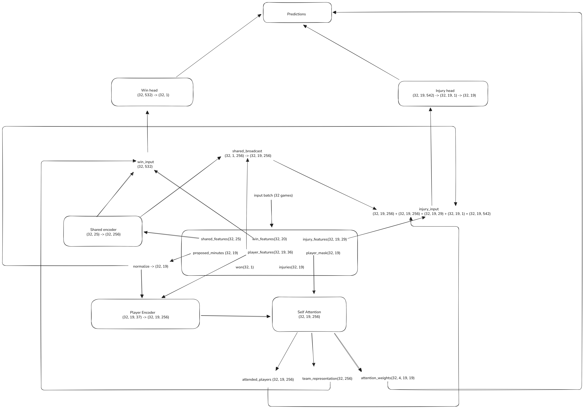

### FeatureEngineer.py
Added `make_pregame_safe()` function, which creates lagged versions of game dependent features like `MIN_INT` or `PLUS_MINUS` so that when we predict a game we don’t use info from the same game.

This was done to lower risk of leakage

In `rolling_features()` changed rolling calculations to be pregame safe by applying `shift(1)` so only previous games contribute.

Also fixed `TEAM_WIN_RATE_10` by shifting it by 1 before merging it back

In `injury_features()` included additional features such as `INJURY_NEARBY_PAST` (rolling max over the last 7 games, shifted)

In `opponent_features` fixed logic mistake now Strong/Weak opponent is now based on direct position comparison

### GameDataset.py
This class converts a player level table into game level dataset where each sample corresponds to one team in one game.
Each sample contains:
- shared game context (same for all players)
- player features
- targets for minutes played, team win, next game injuries
- a mask indicating which player slots are real (1 - real player, 0 - padding)

Each game is padded to the same number of player slots and `player_mask` in this case tells the model which slots are real

Also players are sorted using `MIN_INT_LAG1`

All Features are in `features.py` file

### dataloaders.py
This function builds train/val/test DataLoaders using time based split, so that model is trained on earlier games and evaluated on later games

I decided not to use a random split because with time based split the model never trains on games that happen after validation/test games so that prevents time leakage

The split is done by unque dates, so games from the same date do not end up in different splits


### SmartLoadModel.py
So, the model has to predict two things at the same time:
1. Will this team win
2. Which players are likely to be injured in the next game

We need multi-task neural network architecture for this task.



At the same time both predictions have to be conditionaed on the proposed minutes allocation so that win probability and injury risk dependent on how many minutes are assigned to each player

Our batch consists of
```shared_features:torch.Size([32, 25]) - 1 vector per team
player_features:torch.Size([32, 19, 36]) - 1 vector per player
actual_minutes:torch.Size([32, 19]) - proposed minutes
player_mask:torch.Size([32, 19]) - 1 for real players 0 for padding
win_features:torch.Size([32, 20]) -  game level features
injury_features:torch.Size([32, 19, 29]) - injury related features
won:torch.Size([32, 1]) - labels for win
injuries:torch.Size([32, 19]) - labels for injuries
num_players:torch.Size([32]) - number of players
```

We need to transform each player’s feature into a 256 dimensional embedding so the model will can learn something
```
self.player_encoder = nn.Sequential(
    nn.Linear(n_player_features + 1, hidden_dim),  # +1 for proposed minutes
    nn.LayerNorm(hidden_dim),
    nn.ReLU(),
    nn.Dropout(dropout),
    nn.Linear(hidden_dim, hidden_dim),
    nn.LayerNorm(hidden_dim),
    nn.ReLU(),
    nn.Dropout(dropout)
)
```
`n_player_feautures + 1` because player representation needs to encode how much the player will play because injury risk and team strength depend on playing time

Structure
- Linear layers (mix and tranform features)
- LayerNorm (stabilize feature scales)
- ReLU (adds non-linearity)
- Dropout (prevent overfitting)

Also dropout is used twice to avoid model over fitting I assume that while training model can start to memorize patterns based on minutes because this is a very strong signal so I added 2 dropouts

`_augment_minutes()` function normalzes minutes to precents to help model understand relative playing time. We also need to add some random noise to actual minutes to prevent model to memorize exact minute patterns

Output: (32, 19, 256) - each player represented as 256 dimensional vector

### SelfAttentionPooling.py
We need to enable players to learn from their teammates (best combination/synergy). It will capture how players depend on their teammates

`attended_output = self.norm(player_encodings + attended)`

Each player encoding contains their own info and information about their teammates

Attention in general produces updated player embeddings, and then pooling aggregates them into one team vector

For output:
```
- attended_players: (32, 19, 256) - players aware of teammates
- team_representation: (32, 256) - aggregated team strength
- attention_weights: (32, 4, 19, 19) - which players attend to which
```

Shred context encoder
```
self.shared_encoder = nn.Sequential(
    nn.Linear(n_shared_features, hidden_dim),
    nn.LayerNorm(hidden_dim),
    nn.ReLU(),
    nn.Dropout(dropout)
)
```
This shared game context for all players, returns 256 dimensional vector

Win prediction head
```
self.win_head = nn.Sequential(
    nn.Linear(hidden_dim + hidden_dim + n_win_features, hidden_dim),
    nn.LayerNorm(hidden_dim),
    nn.ReLU(),
    nn.Dropout(dropout),
    nn.Linear(hidden_dim, hidden_dim // 2),
    nn.ReLU(),
    nn.Dropout(dropout),
    nn.Linear(hidden_dim // 2, 1)  # Binary - win/lose (1/0)
)
```
```
win_input = torch.cat([shared_encoded, team_representation, batch['win_features']], dim=-1)
```
It combines game context (32, 256) aggregated player strength and their synergy (32, 256) and win features (32, 20)

Architecture: 532 -> 256 -> 128 -> 1

Output: single logit per game (32, 1)

Injury prediction head

```
self.injury_head = nn.Sequential(
    nn.Linear(hidden_dim + hidden_dim + n_injury_features + 1, hidden_dim),  # +1 for minutes
    nn.LayerNorm(hidden_dim),
    nn.ReLU(),
    nn.Dropout(dropout),
    nn.Linear(hidden_dim, hidden_dim // 2),
    nn.ReLU(),
    nn.Dropout(dropout),
    nn.Linear(hidden_dim // 2, 1)
)
```

Each player needs game context for injury prediction so we need to expand shared_encoded from (32, 256) to (32, 19, 256) by copying it for each player slot

`shared_broadcast = shared_encoded.unsqueeze(1).expand(-1, max_players, -1)`

```
injury_input = torch.cat([
    attended_players,           # (32, 19, 256) - Player encoding with team context
    shared_broadcast,           # (32, 19, 256) - Game situation (same for all)
    batch['injury_features'],   # (32, 19, 29)  - Injury risk features
    normalized_minutes.unsqueeze(-1)  # (32, 19, 1) - How much they'll play
], dim=-1)
```
Architecture: (542)-> 256 -> 128 -> 1

### SmartLoadLoss.py
It combines Win Loss (binary cross entropy on win predictions) and Injury Loss (binary cross entropy on injury predictions, masked to only include real players)

Injury loss is averaged only over active players using mask, so  padding doesn’t affect training

`total_loss = win_weight * win_loss + injury_weight * injury_loss`
